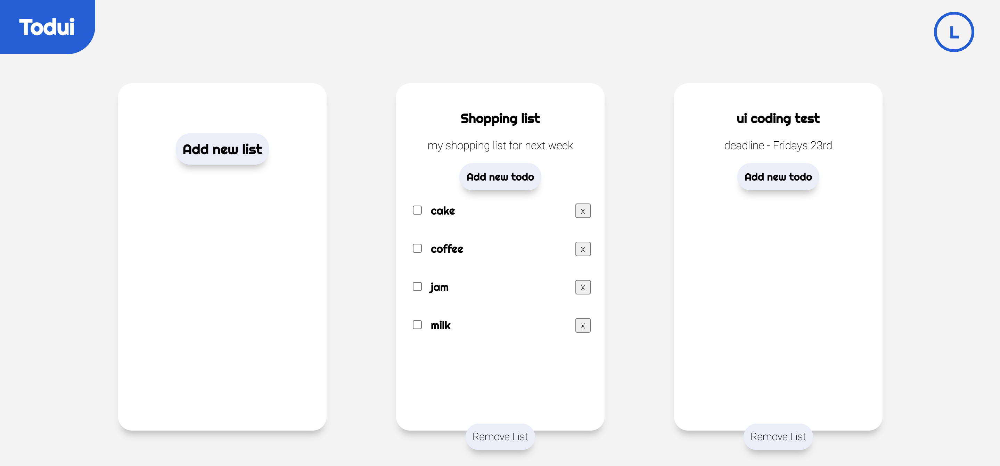

# UI Full-Stack home assignment - “Reminders App”

## Technical Requirements
● Language: TypeScript  
● Framework: React  
● Backend: Node

In the project directory, you can run:

### User Stories Implemented:

- Login with jwt token.
- I as a user can create to-do items, such as a grocery list.
- I as a user can mark to-do items as “done” - so that I can avoid clutter and focus onthings that are still pending.
- I as a user can add sub-tasks to my to-do items - so that I could make logical groups oftasks and see their overall progress.
- I as a user can add sub-descriptions of tasks in Markdown and view them as rich textwhile I'm not editing the descriptions.
- I as a user can be sure that my todos will be persisted so that important information isnot lost when server restarts.

### User Stories to Consider for future improvements:

- I as another user can collaborate in real-time with user - so that we can(for example) edit our family shopping-list together.
- I as a user can filter the to-do list and view items that were marked as done - so that Ican retrospect on my prior progress.
- I as a user can specify cost/price for a task or a subtask - so that I can track myexpenses / project cost.
- I as a user can see the sum of the subtasks aggregated in the parent task - so that in myshopping list I can see what contributes to the overall sum. For example I can have atask “Salad”, where I'd add all ingredients as sub-tasks, and would see how much doessalad cost on my shopping list.
- I as a user can make infinite nested levels of subtasks.
- I as a user can see the cursor and/or selection of another-user as he selects/types whenhe is editing text - so that we can discuss focused words during our online call.
- I as a user can create multiple to-do lists where each list has it's unique URL that I canshare with my friends - so that I could have separate to do lists for my groceries and workrelated tasks.
- In addition to regular to-do tasks, I as a user can add “special” typed to-do items, that willhave custom style and some required fields:
  ○ ”work-task”, which has a required field “deadline” - which is a date
  ○ “food” that has fields:
    ■ required: “carbohydrate”, “fat”, “protein” (each specified in g/100g).
    ■ optional: “picture” an URL to an image used to render this item.
- I as a user can keep editing the list even when I lose internet connection, and can expectit to sync up with BE as I regain connection.
- I as a user can change the order of tasks via drag & drop.
- I as a user can move/convert subtasks to tasks via drag & drop.
- I as an owner/creator of a certain to-do list can freeze/unfreeze a to-do list I've created toavoid other users from mutating it.
